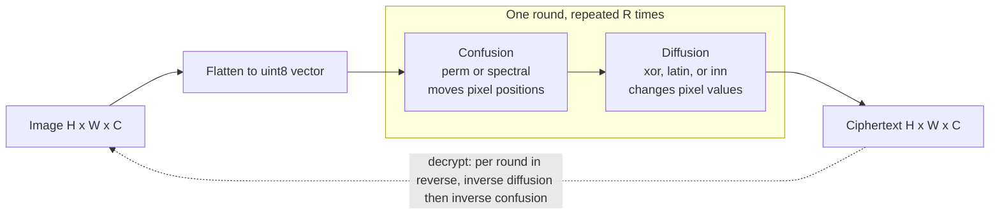

# Modular Image Encryption: Confusion x Diffusion

A modular image-encryption pipeline with swappable **confusion** (permutation)
and **diffusion** (value-mixing) primitives, a Streamlit frontend, and a
security-metrics harness. Built as a comparative framework for studying
image-encryption building blocks.

## Architecture



The image is flattened to a `uint8` vector, then each round applies
**confusion** followed by **diffusion**. This repeats for `R` rounds.
Decryption runs the rounds in reverse order, applying the inverse diffusion
then the inverse confusion at each step. Every combination is exactly
invertible: `decrypt(encrypt(x)) == x`, lossless across grayscale, RGB, and
odd dimensions.

**Key derivation.** Each stage gets its own subkey: a label like
`perm{round}` or `inn{round}.{layer}` is combined with the secret key and run
through SHA-256, and the first 8 bytes seed a dedicated `numpy` random
generator. So every stage and round is keyed independently from the same
master key, and nothing is reused across positions in the pipeline.

## Modules at a glance

| Stage | Module | One-line idea |
|-------|--------|---------------|
| Confusion | `perm` | Keyed global pixel permutation (baseline) |
| Confusion | `spectral` | Graph-spectral block ordering via the Fiedler vector |
| Diffusion | `xor` | Keyed XOR keystream (baseline) |
| Diffusion | `latin` | Keyed Latin-square additive mixing (balanced, linear) |
| Diffusion | `inn` | Keyed integer coupling network (RealNVP-style, lossless) |

## How each technique works

### Confusion (permutation): scrambles *where* pixels are

Confusion only moves pixels around. It leaves the set of pixel values
untouched, so the histogram and the global entropy do not change, but the
spatial pattern and adjacent-pixel correlation collapse.

**`perm` (baseline).**
The secret key seeds a random generator that produces a full random
permutation of all pixel indices. Encryption gathers pixels in that shuffled
order; decryption scatters them back using the inverse permutation. It is the
simplest, strongest scrambler in terms of breaking spatial structure, but it
carries no notion of image geometry.

**`spectral`.**
A geometry-aware alternative. The image is split into an 8 x 8 grid of blocks.
A key-seeded symmetric weight matrix defines a graph over those blocks (the
weights are content independent, so the same key always gives the same
ordering). The pipeline forms the graph Laplacian `L = D - A`, takes its
**Fiedler vector** (the eigenvector of the second-smallest eigenvalue, the
classic spectral-clustering ordering signal), and sorts the blocks by that
vector. Encryption reorders blocks into that order; decryption restores the
original order. If the image is too small to fill the grid, it falls back to
`perm`.

### Diffusion (value mixing): changes *what* the pixel values are

Diffusion rewrites pixel values so a tiny change in the input spreads across
the output. This is what flattens the histogram, pushes entropy toward the
ideal 8.0 bits, and drives the differential-attack metrics (NPCR and UACI).

**`xor` (baseline).**
The key seeds a pseudo-random byte stream the same length as the image, and
each pixel is XORed with its keystream byte. It is self-inverse (XOR twice with
the same stream returns the original) and flattens the histogram well, but it
is linear and each byte is mixed independently, so it provides no avalanche
between pixels on its own.

**`latin`.**
Keyed additive mixing by a Latin square. Each position `i` gets a shift
`add[i] = (a * i + b) mod 256`, where `a` is forced odd so the mapping is
invertible mod 256 and `b` is a keyed offset. Encryption adds the shift,
decryption subtracts it. The construction is **provably balanced** (every
output value is equally likely over positions), which makes it a clean,
analyzable baseline, but it is still **linear**, so it is the intentionally
weak diffusion arm in the comparison.

**`inn` (the strong contender).**
A keyed integer coupling network in the style of RealNVP additive coupling,
built to be exactly invertible over `uint8`. The vector is split into two
halves `a` and `b`. A keyed **causal nonlinear mixer** computes a shift `t`
from the first half, where each `t_i` depends on the key and on every earlier
value `a_j` for `j <= i` through a running accumulator and a key-seeded 8-bit
S-box. The second half is updated as `b = (b + t) mod 256`, then the halves
swap roles, and this repeats for several layers. Because `t` is computed only
from the unchanged half, the exact same `t` can be recomputed at decryption and
subtracted back, so the whole thing inverts perfectly. The causal accumulation
is what creates strong avalanche: flipping one input pixel cascades into all
later outputs, which is why `inn` produces the near-ideal NPCR and UACI numbers
below.

## Quickstart

```bash
pip install -r requirements.txt
streamlit run app.py
```

Run the correctness and metrics harness:

```bash
python test_core.py
```

## Results (perm + inn, 3 rounds)

| Metric | Value | Ideal |
|--------|-------|-------|
| Cipher entropy | 7.997 | 8.0 |
| Adjacent-pixel correlation | -0.0006 | ~0 |
| NPCR | 99.63% | ~99.6 |
| UACI | 33.47% | ~33.4 |

## Blog

For a narrative walkthrough of the techniques, the metrics, and why the
decrypted image stays as noise until the very last step, see
[docs/blog.md](docs/blog.md).

## Files

- `crypto_core.py`: pipeline and all swappable primitives
- `app.py`: Streamlit frontend
- `test_core.py`: round-trip, key-sensitivity, and metrics tests
- `requirements.txt`: dependencies
- `docs/blog.md`: long-form writeup

## License

MIT
